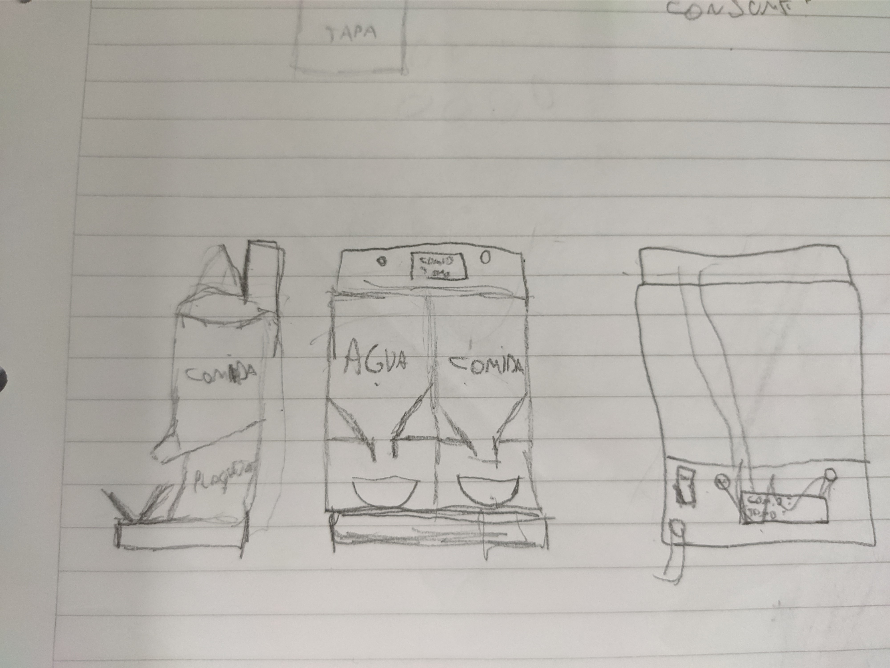

# Proyecto Final 6º Electronica 2022
### Distribuidor automatico de alimento para mascotas domesticas (AlimenCat)
El objetivo de este proyecto es hacer una maquina que permita facilitar el proceso de alimentacion de una mascota domestica, con sensores programados para la despensa de alimentos.

## Integrantes
Integrante|Rol
------------------|--------
Agustin Bondonno | Montaje
Josue De Simone | Programador
Matias Fernandez | Montaje y Diseño de PCB
Franco Ferraro | Programador
